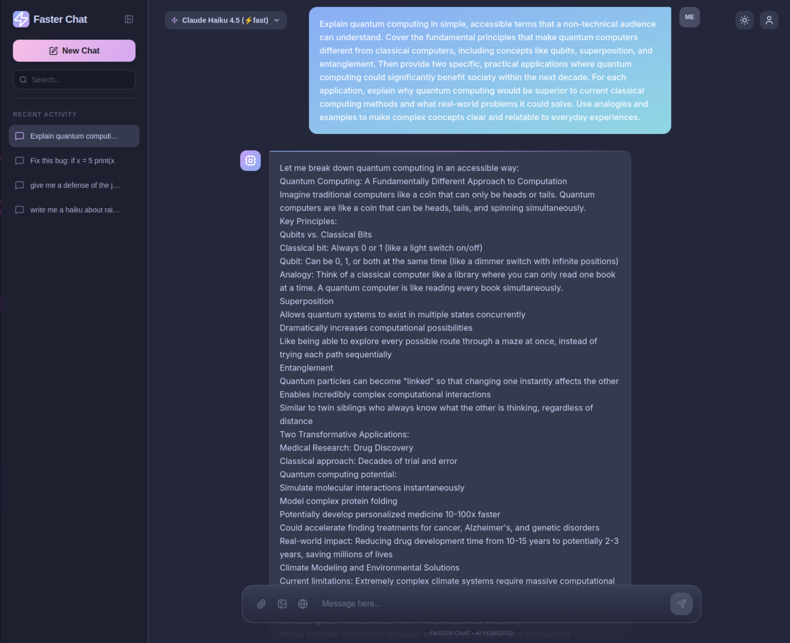
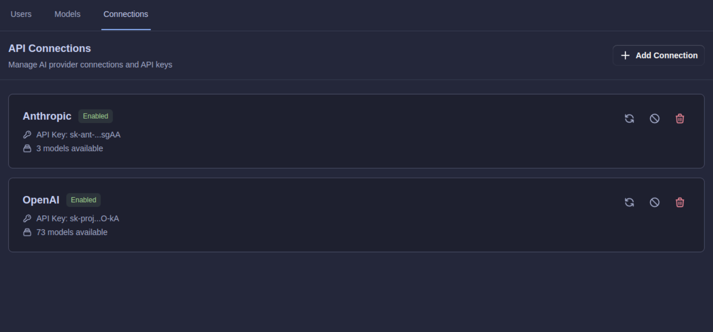
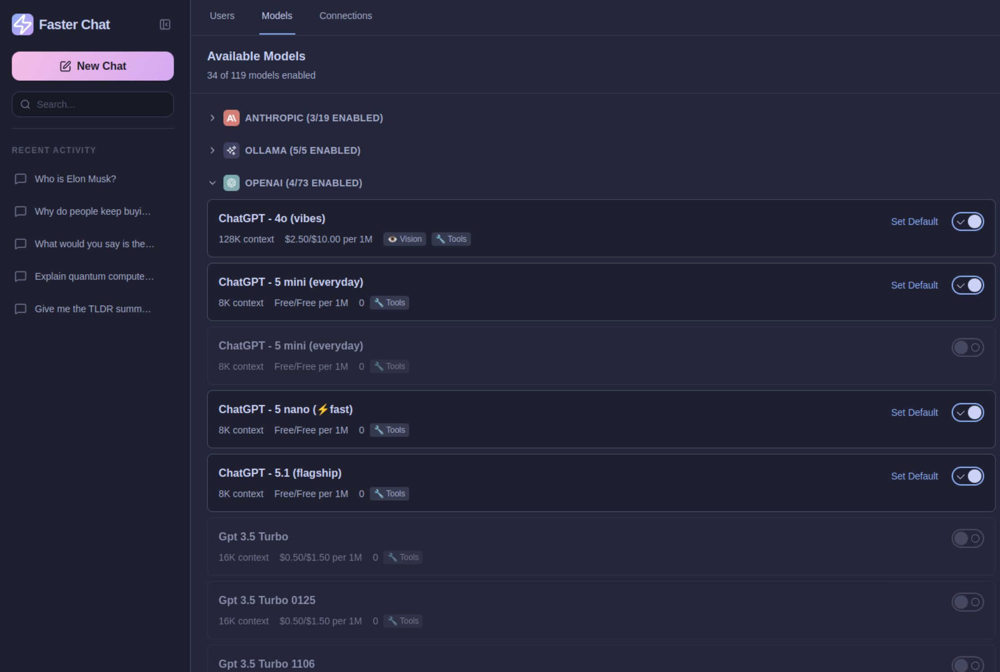

# ⚡ Faster Chat — Open, Offline-First LLM Interface

<p align="left">
  <a href="https://preactjs.com/">
    
  </a>
  <a href="https://hono.dev/">
    
  </a>
  <a href="https://tailwindcss.com/">
    
  </a>
  <a href="https://tanstack.com/router">
    
  </a>
  <a href="https://dexie.org/">
    
  </a>
  <a href="https://sdk.vercel.ai/">
    
  </a>
  <a href="https://bun.sh/">
    
  </a>
  <a href="https://opensource.org/licenses/MIT">
    
  </a>
</p>

> **A blazingly fast, privacy-first chat interface for AI that works with any LLM provider—cloud or completely offline.**

**Faster Chat** is built for developers who want **full control** over their AI conversations. Run it with local models via [Ollama](https://ollama.ai/), connect to any OpenAI-compatible API, or use commercial providers like Claude, GPT, Groq, or Mistral. Your data stays yours—everything works offline-first with local IndexedDB storage.

## 🎯 Why Faster Chat?

- **🔒 Privacy-First**: All conversations stored locally in your browser. No cloud required.
- **🌐 Offline-Ready**: Use completely offline with local LLMs via Ollama, LM Studio, or any local inference server.
- **🔌 Universal Compatibility**: Works with OpenAI, Anthropic, Groq, Mistral, OpenRouter, or any OpenAI-compatible API.
- **⚡ Insanely Fast**: 3KB Preact runtime, zero SSR overhead, streaming responses, instant local saves.
- **🛠️ Self-Hostable**: One-command Docker deployment with optional HTTPS. No vendor lock-in.
- **🎨 Modern Stack**: Preact + Hono + TanStack + Tailwind 4.1 + AI SDK.



## ✨ Current Features

- 💬 **Streaming Chat Interface** — Real-time token streaming with Vercel AI SDK
- 🗄️ **Local-First Persistence** — All chats saved to IndexedDB (Dexie) with server-side SQLite backup
- 🤖 **Multi-Provider Support** — Switch between Anthropic, OpenAI, Ollama, and custom endpoints
- 🎨 **Beautiful UI** — Tailwind 4.1 with Catppuccin color scheme and shadcn-style primitives
- 📱 **Responsive Design** — Works seamlessly on desktop, tablet, and mobile
- ⚙️ **Model Management** — Easy switching between models and providers with auto-discovery
- 📝 **Markdown & Code Highlighting** — Full markdown rendering with syntax highlighting and LaTeX support
- 📎 **File Attachments** — Upload and attach files to chat messages with preview and download
- 🔐 **Multi-User Auth** — Session-based login, logout, and registration (first user becomes admin)
- 🛡️ **Admin Panel** — Role-based access with user CRUD (create, delete, reset password, change roles) and admin-only routes
- 🔑 **API Key Management** — Securely store and manage API keys for multiple providers with encryption
- 🐳 **Docker Ready** — One-command deployment with optional Caddy for automatic HTTPS

## 🚀 Planned Features

We're building Faster Chat into the most flexible, privacy-respecting AI interface available:

### 🎛️ Settings & Configuration
- ✅ **API Management UI** — Add/remove/configure API keys and endpoints (Admin → Connections)
- ✅ **Custom Provider URLs** — Point to LMStudio, GroqCloud, Mistral API, OpenRouter, or your own inference server
- ✅ **Model Discovery** — Auto-detect available models from connected providers
- [ ] **Offline Model Management** — Browse and pull Ollama models directly from the UI
- 🚧 **User Settings Page** — Basic account info page exists; full preferences UI coming soon

### 📝 Content & Capabilities
- ✅ **Markdown Rendering** — Full markdown support with react-markdown
- ✅ **Code Syntax Highlighting** — Automatic language detection with Prism
- ✅ **LaTeX Support** — Render math equations in responses with KaTeX
- ✅ **File Attachments** — Upload documents, images, and context for your conversations
- [ ] **Tool Calling** — Infrastructure ready; full implementation pending
- [ ] **Image Generation** — Integrated support for DALL-E, Stable Diffusion, and local image models
- [ ] **Web Search Integration** — Give your AI real-time internet access (optional)
- [ ] **Local RAG** — Vector search over your documents with complete privacy

### 🔐 Privacy & Control
- ✅ **Fully Offline Mode** — Work completely disconnected with local models
- ✅ **Multi-User Auth** — Role-based access with session management
- ✅ **Server Persistence** — SQLite persistence with offline-first IndexedDB
- [ ] **Data Export** — Download all your conversations in standard formats
- [ ] **Postgres Support** — Optional PostgreSQL backend

### 🎨 Enhanced UX
- **Voice Input/Output** — Speak to your AI and hear responses
- **PWA Support** — Install as a native app with offline capabilities
- **Sharing & Collaboration** — Share conversations with teams
- **Conversation Branching** — Explore alternative responses
- **Dark/Light Themes** — Full theme customization

## Changelog

See `CHANGELOG.md` for version history (current: 0.2.0 Preact/Hono refactor and TypeScript removal).

## 🔧 Getting Started

### Prerequisites

- [Bun](https://bun.sh/) (recommended) or Node.js 20+
- At least one AI provider:
  - **Offline**: [Ollama](https://ollama.ai/) running locally
  - **Cloud**: API key from OpenAI, Anthropic, Groq, Mistral, or OpenRouter
  - **Self-Hosted**: LM Studio, vLLM, or any OpenAI-compatible inference server

### Quick Start

```bash
# Clone the repository
git clone https://github.com/1337hero/faster-next-chat.git
cd faster-next-chat

# Install dependencies
bun install

# Configure your AI providers
cp server/.env.example server/.env

# Edit server/.env with your API keys or local endpoints:
# ANTHROPIC_API_KEY=sk-ant-...
# OPENAI_API_KEY=sk-...
# OLLAMA_BASE_URL=http://localhost:11434

# Start development servers
bun run dev
```

The app will be available at:
- **Frontend**: http://localhost:3000
- **API Server**: http://localhost:3001
  - (Production Docker deployment uses port 8787)

### Authentication & Roles

- Register at `/login`; the **first account created is promoted to admin** automatically.
- Admins can open `/admin` → Users tab to create users, reset passwords, and set roles (`admin`, `member`, `readonly`).
- Sessions use HTTP-only cookies (`credentials: include`), so keep frontend and API on the same origin/ports listed above in development.

#### Admin Panel

The admin panel provides full control over API connections and model management:


*Manage AI provider connections and API keys*


*Enable and configure models from multiple providers*

### Using Offline with Ollama

```bash
# Install Ollama (macOS/Linux)
curl -fsSL https://ollama.ai/install.sh | sh

# Pull a model
ollama pull llama3.2

# Set in server/.env
OLLAMA_BASE_URL=http://localhost:11434

# Start Faster Chat
bun run dev
```

### Custom Provider Setup

Faster Chat works with **any OpenAI-compatible API**. Examples:

```bash
# LM Studio
OPENAI_BASE_URL=http://localhost:1234/v1

# Groq Cloud
OPENAI_BASE_URL=https://api.groq.com/openai/v1
OPENAI_API_KEY=gsk_...

# OpenRouter (access 100+ models)
OPENAI_BASE_URL=https://openrouter.ai/api/v1
OPENAI_API_KEY=sk-or-...

# Mistral AI
OPENAI_BASE_URL=https://api.mistral.ai/v1
OPENAI_API_KEY=...

# Self-hosted vLLM/TGI
OPENAI_BASE_URL=http://your-inference-server:8000/v1
```

## 📦 Development Commands

**Root (monorepo)**:
```bash
bun run dev         # Start frontend + API concurrently
bun run build       # Build all packages for production
bun run start       # Run production builds
bun run clean       # Remove all build artifacts
```

**Frontend**:
```bash
cd frontend
bun run dev         # Vite dev server on :3000
bun run build       # Production build to dist/
bun run preview     # Preview production build
```

**Server**:
```bash
cd server
bun run dev         # Hono dev server with hot reload on :8787
bun run build       # Build for production
bun run start       # Run production server
```

## 🐳 Docker Deployment

### Quick Start with Docker

```bash
# 1. Clone and configure
git clone https://github.com/1337hero/faster-next-chat.git
cd faster-next-chat

# 2. Set up environment
cp server/.env.example server/.env
# Edit server/.env with your API keys

# 3. Generate encryption key
echo "API_KEY_ENCRYPTION_KEY=$(node -e "console.log(require('crypto').randomBytes(32).toString('hex'))")" >> server/.env

# 4. Start with Docker
docker compose up -d

# Access at http://localhost:8787
# Note: Docker uses port 8787 by default (configurable via APP_PORT/HOST_PORT)
# Development mode uses port 3001
```

### Docker Architecture

The Docker setup uses a **hybrid build approach** for maximum compatibility:

- **Builder Stage**: Bun 1.3 on Debian (fast dependency installation)
- **Runtime Stage**: Node.js 22 on Debian (native module compatibility)
- **Port**: 8787 (configurable via `APP_PORT` environment variable)
- **Volume**: SQLite database persisted in `chat-data` volume

### Optional: HTTPS with Caddy

Add automatic HTTPS with Caddy reverse proxy:

```bash
# Start with Caddy (adds ~13MB)
docker compose -f docker-compose.yml -f docker-compose.caddy.yml up -d

# Access via HTTP
http://localhost

# For production with your domain:
# 1. Edit Caddyfile and uncomment the production block
# 2. Replace chat.yourdomain.com with your actual domain
# 3. Point your DNS A record to your server
# 4. Restart: docker compose -f docker-compose.yml -f docker-compose.caddy.yml up -d
# Caddy automatically handles Let's Encrypt certificates!
```

**Features:**
- ✅ Automatic HTTPS with Let's Encrypt
- ✅ Auto-renewal of SSL certificates
- ✅ HTTP/2 and HTTP/3 support
- ✅ Gzip/Zstd compression
- ✅ Security headers pre-configured
- ✅ Only 13MB overhead (Alpine-based)

See `docs/caddy-https-setup.md` for local HTTPS setup and `docs/docker-setup.md` for detailed configuration.

### Environment Variables

```bash
# App Configuration
APP_PORT=8787                    # Internal app port
HOST_PORT=8787                   # Exposed port on host
NODE_ENV=production              # Environment mode

# Database
DATABASE_URL=sqlite:///app/server/data/chat.db

# Security (REQUIRED)
API_KEY_ENCRYPTION_KEY=...       # Generate with: node -e "console.log(require('crypto').randomBytes(32).toString('hex'))"

# AI Providers (add as needed)
ANTHROPIC_API_KEY=sk-ant-...
OPENAI_API_KEY=sk-...
OLLAMA_BASE_URL=http://host.docker.internal:11434  # For local Ollama
```

### Docker Commands

```bash
# Start services
docker compose up -d

# View logs
docker compose logs -f

# Stop services
docker compose down

# Rebuild after code changes
docker compose up -d --build

# Reset database (removes all data)
docker compose down
docker volume rm faster-chat_chat-data
docker compose up -d
```


## 🧭 Roadmap

### Phase 1: Core Refactor ✅
- [x] Migrate from Next.js to Preact + Hono
- [x] Streaming chat with AI SDK
- [x] Local-first persistence (Dexie/IndexedDB)
- [x] Multi-provider support (Anthropic, OpenAI, Ollama)
- [x] Tailwind 4.1 migration

### Phase 2: Settings & Flexibility ✅
- [x] Admin panel for API/model/user management
- [x] Custom provider URL configuration UI
- [x] Model discovery and auto-detection
- [x] Basic user-facing settings page (account info)
- [ ] Ollama model browser and downloader
- [ ] Keyboard shortcuts and accessibility
- [ ] Advanced user preferences UI

### Phase 3: Enhanced Capabilities ✅
- [x] Markdown rendering with react-markdown
- [x] Code syntax highlighting with Prism
- [x] LaTeX rendering for mathematical equations
- [x] File attachments (documents, images)
- [ ] Tool calling implementation
- [ ] Image generation integration
- [ ] Web search capabilities
- [ ] Local RAG with vector search

### Phase 4: Multi-User & Deployment ✅
- [x] User authentication and sessions (cookie-based)
- [x] Role-based access control (admin/member/readonly)
- [x] Server-side persistence (SQLite)
- [x] Docker image + docker-compose
- [x] One-command self-hosting
- [x] Optional HTTPS with Caddy
- [ ] Conversation sharing and collaboration

### Phase 5: Advanced Features 🌟
- [ ] Voice input/output
- [ ] PWA with offline install
- [ ] Conversation branching
- [ ] Multi-modal requests (vision, audio)
- [ ] Plugin system for extensions
- [ ] Mobile app (Capacitor)

## 🎨 Design Philosophy

**Faster Chat** follows opinionated architectural principles:

- **Offline-First**: Your data lives in your browser. Server is optional.
- **Provider-Agnostic**: Never lock you into a single AI vendor.
- **Minimal Runtime**: 3KB Preact instead of React. No SSR bloat.
- **Local Control**: Run completely offline with local models.
- **Fast Iteration**: Bun for speed, no TypeScript ceremony, clear patterns.
- **Composable UI**: Small focused components, derive state in render.
- **Delete Aggressively**: Best code is no code. Remove what you don't need.

See `AGENTS.md` for detailed coding principles and architectural decisions.

## 🤝 Contributing

We welcome contributions! Whether it's:
- 🐛 Bug fixes and error handling
- ✨ New provider integrations
- 📝 Documentation improvements
- 🎨 UI/UX enhancements
- 🧪 Tests and quality improvements

Please read `AGENTS.md` for our coding philosophy and architectural guidelines. PRs should align with our lightweight, streaming-first, offline-capable approach.

## 💡 Philosophy: Why We Dropped TypeScript

We value **speed over ceremony**. TypeScript's compile step, constant type churn across fast-moving AI SDKs, and mismatched third-party definitions slowed us down more than they helped.

Our guardrails:
- ✅ Runtime schema validation where it matters
- ✅ Shared constants and clear contracts
- ✅ Tests for critical paths
- ✅ JSDoc for complex functions

The trade-off is deliberate: **less friction, faster iteration, easier contribution**.

## 📄 License

MIT License - see [LICENSE](LICENSE) for details.

---

## ⭐ Star History

If Faster Chat helps you take control of your AI conversations, consider giving us a star!

[](https://www.star-history.com/#open-webui/open-webui&1337hero/faster-next-chat&type=date&legend=top-left)

---

<p align="center">
  <strong>Built with ❤️ for developers who value privacy, speed, and control.</strong><br>
  <sub>No tracking. No analytics. Just fast, local-first AI conversations.</sub>
</p>
